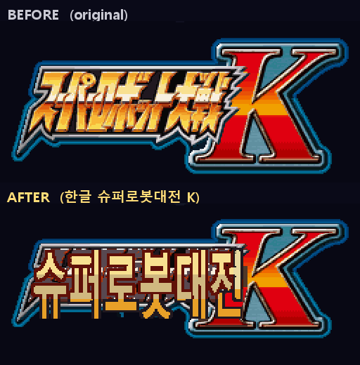

# Super Robot Wars K — 한글화 도구 (SRWK Korean Translation Toolkit)

닌텐도 DS **슈퍼로봇대전 K** (Super Robot Wars K, バンプレスト/2009)의 한글 번역을 완성·확장하기 위한 리버스 엔지니어링 도구 모음입니다. 기존 YameSoft 한글 패치에서 미번역으로 남아 있던 부분(메뉴, 기체명, 시스템 메시지, 스태프 크레딧, 후반부 시나리오)을 채우고, **타이틀 로고 한글화**와 **시나리오 대사 박스 넘침으로 인한 프리즈** 등을 해결했습니다.

> ⚠️ **저작권**: 이 저장소에는 **게임 ROM, 추출한 게임 바이너리(arm9 / add0Xdat / overlay), 원본 게임 스크립트가 포함되어 있지 않습니다.** 도구를 사용하려면 본인이 합법적으로 소유한 ROM을 직접 덤프해야 합니다. 도구와 기술 문서, 결과 스크린샷만 공개합니다.

| 타이틀 로고 (전/후) | 시나리오 제목 아이캐치 (게임 폰트 렌더) |
|---|---|
|  |  |

---

## 패치 다운로드 & 적용 (Patch)

완성된 한글 패치: **[`patch/SRWK-Korean.xdelta`](patch/SRWK-Korean.xdelta)** (약 1.5 MB, xdelta3 / VCDIFF)

1. xdelta 적용 도구(xdelta UI, Delta Patcher 등) 또는 명령줄:
   ```
   xdelta3 -d -s "Super Robot Wars K (Japan).nds" SRWK-Korean.xdelta "Super Robot Wars K (Korean).nds"
   ```
2. **기준 ROM** (본인이 합법적으로 덤프한 것):
   - `Super Robot Wars K (Japan).nds` — **67,108,864 바이트, CRC32 `D16DB8AF`**
3. 결과 ROM:
   - `Super Robot Wars K (Korean).nds` — **63,693,664 바이트, CRC32 `A7319B0F`**

> 이 패치는 **YameSoft 한글 패치(ch1~24 등)를 기반으로**, 후반 시나리오 완역 · 메뉴/기체명/시스템 메시지/스태프 크레딧 · 타이틀 로고 한글화 · 대사 박스 프리즈 수정을 더한 것입니다. xdelta 패치는 차분(diff)일 뿐 게임 데이터를 포함하지 않으므로, 적용하려면 위 기준 ROM이 필요합니다.

---

## 번역 현황

| 항목 | 저장 위치 | 상태 |
|---|---|---|
| 시나리오 대사 | `data/add03dat.bin` | ✅ 한글 (커스텀 코덱) |
| 전투 대사 | `data/add05dat.bin` | ✅ 한글 (외부 사전 코덱) |
| 메뉴 / 기체명 / 시스템 메시지 / 인물명 | `arm9.bin` | ✅ 한글 (in-place / repoint 주입) |
| 스태프 크레딧 (142개) | `overlay/ovl_003` | ✅ 한글 (오버레이 확장) |
| 시나리오 제목 아이캐치 (65개) | `overlay/ovl_004` 텍스트 + 공용 폰트 | ✅ 한글 (폰트 렌더, 이미지 아님) |
| 타이틀 로고 「スーパーロボット大戦」 | `data/add02dat.bin` #2360 | ✅ 「슈퍼로봇대전」 (4th 코덱 재주입) |

---

## 기술적 성과 (해독한 포맷)

### 1. 시나리오 대사 코덱 — `add03dat.bin`
원본 도구(YameSoft `SRWKDesc`, C#)의 코덱을 파이썬으로 충실히 포팅 (`srwk_native.py`).
- **코드북(Font) 블록**: `T=cb[0x11]`, `FontStart=i32@0x14`, `IdiomStart=i32@0x18`, idiom 쌍(누적빈도→오프셋)@0x20, `FontEnd=i32@0x2C`, `Map=cb[FontStart:FontEnd+2]` (인덱스→SJIS 코드).
- **노드(대사 박스)**: `[code1:i16][code2:i16]` (옵션 changeName) + 길이 접두 sub-line들 (`len%0x80` 바이트, `len>0x80`이 마지막).
- 새 챕터(ch25+)는 코드북을 번역 텍스트로부터 재생성(InsertMap) — 출시 ch1~24와 바이트 단위로 동일한 방식.

### 2. "4th 코덱" — 타이틀/아이캐치 이미지 (1024바이트 링버퍼 LZSS) ⭐
오랫동안 미해독이던 8bpp(IMG\x01) 이미지 압축. arm9를 **시그니처 스캔**(플래그 비트 + `strb` 출력 + 역참조 `ldrb` 루프)해 압축 해제기를 **arm9 0x0200E8B0**에서 발견하고 알고리즘을 완전 해독·재구현했습니다 (`_codec1024.py` 디코더 / `_enc1024.py` 인코더, 라운드트립 검증 완료).

```
window = 1024 bytes, init 0;  write pos sb starts at 958 (=1024-66)
flag byte LSB-first:  bit=1 literal,  bit=0 backref
backref(2 bytes):  len=(b2&0x3f)+3 (3..66),  disp=b1|((b2&0xc0)<<2) (10-bit absolute window pos)
ECD header:  f1=BE32[4:8]=8 preamble, f2=BE32[8:12]=compressed size, f3=BE32[12:16]=decompressed size
```

이 코덱은 IMG\x00(4bpp)·IMG\x01(8bpp) **양쪽 모두**에 쓰입니다 (기존에 알려진 4096-링 가정은 오류였음). 이를 통해 타이틀 로고를 디코드→한글 재작도→재인코딩→주입할 수 있게 되었습니다.

### 3. 타이틀 로고 — OBJ 스프라이트 2D 매핑 재작도 ⭐
타이틀 로고 「スーパーロボット大戦K」는 BG 이미지가 아니라 **OBJ 스프라이트 70장**으로 그려지며, 각 스프라이트는 add02 #2360을 OBJ VRAM(뱅크 F+G)에 **그대로 DMA**한 타일을 참조합니다 (검증: 디코드 == VRAM 100% 일치).
- **핵심**: 멀티타일 스프라이트의 타일 인덱스는 1D가 아니라 **2D 매핑**(행 간격 = 32타일, `tile + ty*32 + tx`)으로 읽힙니다. 이 점을 놓치면 픽셀이 맞아도 화면에서 타일 순서가 어긋나 깨집니다 (초기 시도가 실패한 원인).
- 세이브스테이트의 OAM·OBJ 팔레트로 표시 화면을 정확히 복원한 뒤, 금색 카타카나 영역만 한글 「슈퍼로봇대전」으로 재작도. 스프라이트마다 **자기 팔레트에서 가장 가까운 색**으로 양자화해 원본의 금색 그라데이션·파란 외곽선·빨간 K를 보존합니다 (`_redraw2.py`).
- 수정된 타일 → #2360 재인코딩(4th 코덱) → add02 재조립 (`_inject_title3.py`).

### 4. 폰트 / 아이캐치 렌더 경로
- ROM의 글리프 폰트는 **단 하나**: arm9 0x4400A. 26바이트 레코드 `[u16 SJIS BE][24바이트 1bpp 12×16 비트맵]`, 코드 0x814D~0x9872. 한글 패치는 코드 ≥0x889F를 **KS X 1001 완성형 2350자**로 교체(검증: 0x889F=가).
- 시나리오 제목 아이캐치는 **별도 이미지가 아니라**, ovl_004의 텍스트를 위 공용 폰트로 약 2배 확대 렌더한 것 — 텍스트가 이미 한글이라 아이캐치도 한글로 표시됩니다 (별밤 배경 add04 #16674-16677만 이미지).

### 5. 대사 박스 3줄 제한 — 프리즈 수정 ⭐
시나리오 대사 박스는 **최대 3줄(각 ≤176 폭단위; 한글 음절=12, 기타=8)**. 한글 번역이 일본어 원문보다 넓어 ch25+의 박스가 4~5줄로 넘쳐 **게임이 멈추고**, 넘친 박스가 다음 박스 렌더를 손상시켜 **글자가 깨지는** 버그가 있었습니다. `build_native.py`의 `json_to_nodes`에서 넘치는 박스를 **재배치(reflow) 후 균형 분할**(같은 화자명으로 이어지는 ≤3줄 박스)하여 **번역 손실 없이** 해결했습니다.

### 6. 기타 포맷
- **PRX/오버레이 주입**: in-place(슬롯에 맞으면) / repoint(맞지 않으면 빈 공간으로 이전 + 포인터 갱신) — `_inject_arm9.py`, `_inject_credits.py`.
- **전투 코덱**(`add05dat.bin`): 외부 사전(`일본어/한글테이블.txt`) 기반, 211-i32 상단 포인터 테이블 + 미션별 서브헤더 (`srwk_battle.py`).

---

## 저장소 구조

```
tools/
  srwk_rom.py        ROM / add0X 아카이브 처리
  srwk_codec.py      KS X 1001 완성형 ↔ SJIS 매핑, Add03 컨테이너
  srwk_native.py     시나리오 대사 코덱 (디코드/인코드/코드북 재생성)
  srwk_battle.py     전투 대사 코덱
  srk_lzss.py        ECD/IMG LZSS (참고; 4th 코덱은 _codec1024 사용)
  srk_gfx.py         Nitro(NCGR/NCLR/NSCR) 그래픽 도구
  _codec1024.py      ★ 4th 코덱 디코더 (1024-링 LZSS)
  _enc1024.py        ★ 4th 코덱 인코더
  _lzss_enc.py       LZSS 인코더(ring/rel)
  extract_native.py  / extract_battle.py    추출
  build_native.py    시나리오 빌드 (대사 박스 3줄 수정 포함)
  build_battle.py    전투 빌드
  build_rom_all.py   전체 ROM 빌드 (시나리오+전투+arm9+크레딧+타이틀 주입)
  _inject_arm9.py    / _inject_credits.py    주입 (arm9 / 크레딧)
  _redraw2.py        ★ 타이틀 로고 OBJ 스프라이트 한글 재작도 (2D 매핑)
  _inject_title.py   / _inject_title3.py    타이틀 #2360 재인코딩·재주입
  _eyepreview.py     아이캐치를 실제 게임 폰트로 렌더 (데모)
docs/images/         결과 스크린샷
```

## 사용법

도구는 본인이 덤프한 ROM/바이너리를 기준으로 동작합니다 (저작권상 데이터는 미포함). 대략적인 흐름:

```bash
pip install ndspy pillow numpy capstone     # 의존성
# 1) 추출:  python extract_native.py   (add03 → JSON)
# 2) 번역:  JSON의 ko 필드 편집
# 3) 빌드:  python build_rom_all.py    → 패치된 .nds
```

`build_native.py`는 편집되지 않은 블록은 바이트 단위로 그대로 두고(회귀 안전), 편집된 블록만 코드북을 재생성·재인코딩한 뒤 디코드-백 자체 검증을 수행합니다.

## 크레딧

- 기반 패치: **YameSoft** 한글 패치 (ch1~24 등)
- 본 도구 / 후반부 시나리오·타이틀·프리즈 수정: 본 저장소
- 원작: ⓒ バンプレスト / 반다이남코, 슈퍼로봇대전 K (각 참전작 판권은 각 권리자)

## 라이선스

도구 코드(이 저장소의 `tools/`)는 MIT. 게임 데이터·자산은 포함하지 않으며 원저작권자에게 귀속됩니다.
